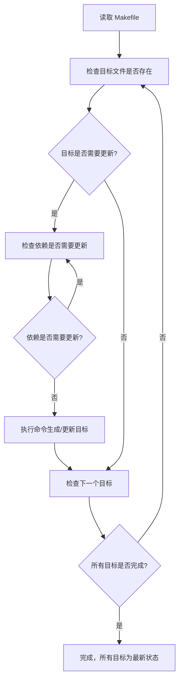
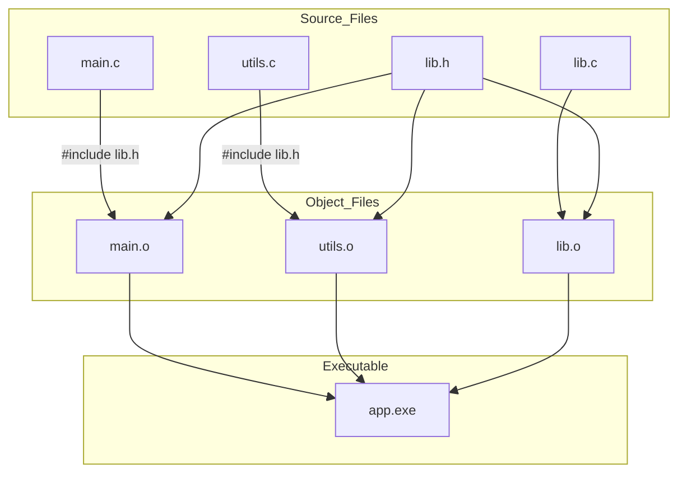

# make_note_1

make学习笔记，主要参考《跟我一起写makefile》学习。

## 1 make 简介

不做过多概念介绍，只简单说明make的作用和工作原理

### 1.1 make的作用

**自动编译程序**：根据源代码和依赖关系，生成可执行文件或库。

**管理依赖关系**：只重新编译修改过的文件，避免全量编译，提高效率。

**执行批量命令**：可以用一条命令执行一系列复杂操作，比如清理、安装、打包。

**构建不同版本**：通过不同的目标（target），生成调试版、发布版、交叉编译版等。

**安装和部署**：可以自动将编译好的程序安装到指定目录。

**自动化测试**：可以定义测试目标，运行单元测试或集成测试。

**生成文档或资源文件**：比如把 markdown、图片、配置文件等生成最终文档或资源包。

**项目清理**：比如 `make clean` 删除临时文件和中间编译产物。

### 1.2 make的作用 

`make` 的工作原理可以直接用流程说明：

1. **读取 Makefile**：获取规则、目标、依赖和命令。
2. **检查目标文件是否存在**：如果目标不存在或依赖比目标新，则需要更新。
3. **递归检查依赖**：依赖本身可能也是目标，先处理依赖的更新。
4. **执行命令**：根据规则执行命令生成或更新目标文件。
5. **重复直到所有目标更新完**：按依赖顺序执行，确保最终所有目标都是最新状态。

可以总结一句：**按规则检查依赖、判断是否需要更新、然后执行命令**。

简单理解：整个过程就是一个**先自上而下检索，检索后自下向上构建的过程**。



这张图展示了 `make` 的核心流程：

- 先读 Makefile;
- 检查目标是否需要更新;
- 递归处理依赖;
- 执行命令;
- 循环直到所有目标更新完毕;

例如：



这个图说明了：

- 每个源文件（`.c`）会编译成对应的目标文件（`.o`）;
- 目标文件依赖头文件（`.h`）;
- 所有目标文件链接生成最终可执行文件.

### 1.3 make 的基本使用规范

1. makefile的命名

> make会在当前目录下找名字叫“Makefile”或“makefile”的文件。优先推荐Makefile。

2. make的基本语法规则

 ```makefile
target ... : prerequisites ...
 command
 ...
 ...
 # This is a code comment.
 ```

> * target 也就是一个目标文件，可以是Object File，也可以是执行文件。还可以是一个标签（Label），对于标签这种特性，在后续的“伪目标”章节中会有叙述。
> * prerequisites 就是，要生成那个target所需要的文件或是目标。
> * command也就是make需要执行的命令。（任意的Shell命令）
> * 代码注释以`#`“井号”开头

其中`:`“冒号”两侧要留空格，`command`要求必须以`Tab`开通或在`target`同行的末尾处用`;`“分号”与前部分隔开

## 2 Makefile 的书写规则


##  3 Makefile 中书写命令


## 4 Makefile 中使用变量


## 5 Makefile 中使用条件判断


## 6 Makefile 中使用函数


## 7 make 的运行


## 8 隐含规则


## 9 使用make更新函数库文件


