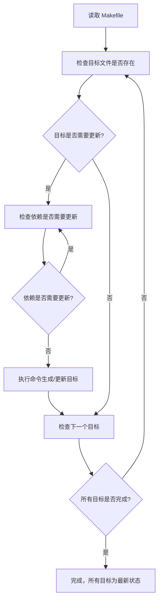
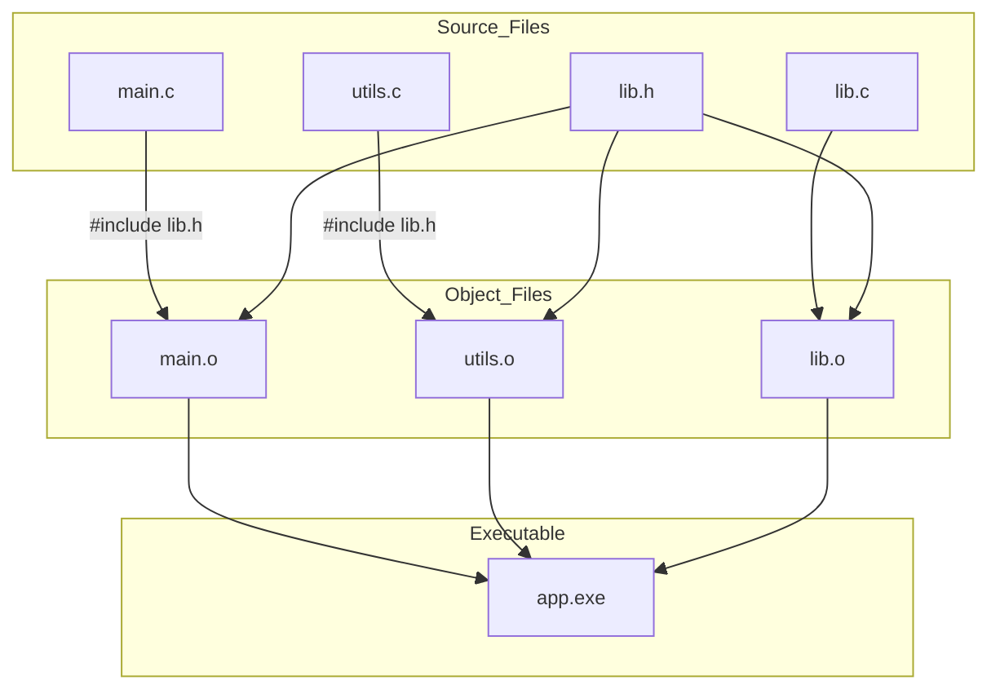

# make_note_1

make学习笔记，主要参考《跟我一起写makefile》学习。

## 1 make 简介

不做过多概念介绍，只简单说明make的作用和工作原理

### 1.1 make的作用

**自动编译程序**：根据源代码和依赖关系，生成可执行文件或库。

**管理依赖关系**：只重新编译修改过的文件，避免全量编译，提高效率。

**执行批量命令**：可以用一条命令执行一系列复杂操作，比如清理、安装、打包。

**构建不同版本**：通过不同的目标（target），生成调试版、发布版、交叉编译版等。

**安装和部署**：可以自动将编译好的程序安装到指定目录。

**自动化测试**：可以定义测试目标，运行单元测试或集成测试。

**生成文档或资源文件**：比如把 markdown、图片、配置文件等生成最终文档或资源包。

**项目清理**：比如 `make clean` 删除临时文件和中间编译产物。

### 1.2 make的作用 

`make` 的工作原理可以直接用流程说明：

1. **读取 Makefile**：获取规则、目标、依赖和命令。
2. **检查目标文件是否存在**：如果目标不存在或依赖比目标新，则需要更新。
3. **递归检查依赖**：依赖本身可能也是目标，先处理依赖的更新。
4. **执行命令**：根据规则执行命令生成或更新目标文件。
5. **重复直到所有目标更新完**：按依赖顺序执行，确保最终所有目标都是最新状态。

可以总结一句：**按规则检查依赖、判断是否需要更新、然后执行命令**。

简单理解：整个过程就是一个**先自上而下检索，检索后自下向上构建的过程**。



这张图展示了 `make` 的核心流程：

- 先读 Makefile;
- 检查目标是否需要更新;
- 递归处理依赖;
- 执行命令;
- 循环直到所有目标更新完毕;

例如：



这个图说明了：

- 每个源文件（`.c`）会编译成对应的目标文件（`.o`）;
- 目标文件依赖头文件（`.h`）;
- 所有目标文件链接生成最终可执行文件.

### 1.3 make 的基本使用规范

1. makefile的命名

> make会在当前目录下找名字叫“Makefile”或“makefile”的文件。优先推荐Makefile。

2. make的基本语法规则

 ```makefile
target ... : prerequisites ...
 command
 ...
 ...
 # This is a code comment.
 ```

> * target 也就是一个目标文件，可以是Object File，也可以是执行文件。还可以是一个标签（Label），对于标签这种特性，在后续的“伪目标”章节中会有叙述。
> * prerequisites 就是，要生成那个target所需要的文件或是目标。
> * command也就是make需要执行的命令。（任意的Shell命令）
> * 代码注释以`#`“井号”开头

其中`:`“冒号”两侧要留空格，`command`要求必须以`Tab`开通或在`target`同行的末尾处用`;`“分号”与前部分隔开

## 2 Makefile 的书写规则

规则包含两个部分，一个是依赖关系，一个是生成目标的方法。

在Makefile中，规则的顺序是很重要的，因为，Makefile中只应该有一个最终目标，其它的目标都是被这个目标所连带出来的，所以一定要让make知道你的最终目标是什么。一般来说，定义在Makefile中的目标可能会有很多，但是第一条规则中的目标将被确立为最终的目标。如果第一条规则中的目标有很多个，那么，第一个目标会成为最终的目标。make所完成的也就是这个目标。好了，还是让我们来看一看如何书写规则。

### 2.1 规则的语法

~~~makefile
targets : prerequisites
command
...
# 或是这样：
targets : prerequisites ; command
command
...
~~~

* targets是文件名，以空格分开，可以使用通配符。一般来说，我们的目标基本上是一个文件，但也有可能是多个文件。
* command是命令行，如果其不与“target:prerequisites”在一行，那么，必须以[Tab键]开头，如果
* prerequisites在一行，那么可以用分号做为分隔。（见上）
* prerequisites也就是目标所依赖的文件（或依赖目标）。如果其中的某个文件要比目标文件要新，那么，目标就被认为是“过时的”，被认为是需要重生成的。这个在前面已经讲过了。

如果命令太长，你可以使用反斜框（‘\’）作为换行符。make对一行上有多少个字符没有限制。规则告诉make两件事，文件的依赖关系和如何成成目标文件。一般来说，make会以UNIX的标准Shell，也就是/bin/sh来执行命令。

#### example 2.1.1

目录结构：

`````
./
├── Makefile
├── makefile.example1
├── readme_make.md
└── src
    ├── defs.h
    ├── foo.c
    └── mian.c
`````

makefile.example1

```makefile
# filename: makefile.example1
src/foo.o : src/foo.c src/defs.h 
	cc -c -g -o src/foo.o src/foo.c

clean:
	rm -rf src/*.o
# 直接执行 make -f makefile.example1 进行编译
# 或执行 make -f makefile.example1 clean清除编译结果

#或通过统一的编译文件直接执行make example1 和 make example1-clean
```


### 2.2 规则中的通配符

如果我们想定义一系列比较类似的文件，我们很自然地就想起使用通配符。make支持三各通配符：“`*`”，“`?`”和“`[...]`”。这是和Unix的B-Shell是相同的。通配符代替了你一系列的文件，如“`*.c`”表示所以后缀为c的文件。一个需要我们注意的是，如果我们的文件名中有通配符，如：“`*`”，那么可以用转义字符“`\`”，如“`\*`”来表示。真实的“`*`”字符，而不是任意长度的字符串。当然有一些其他的“通配符”如`%` `@` 等，实际上这些不是通配符，而是被叫做模式匹配符（`%`）和自动变量（`$@`  `$<` `$^` `$?`）。这里可以简单说明后续做详细说明。

| 通配符  | 含义                     |
| ------- | ------------------------ |
| `*`     | 匹配任意长度字符（含空） |
| `?`     | 匹配任意单个字符         |
| `[...]` | 匹配字符集内的任意字符   |

````makefile
SRC = src/*.c        # 匹配 src 下所有 .c 文件
OBJ = build/*.o      # 匹配 build 下所有 .o 文件
FILES = data/file?.txt  # 匹配 file1.txt file2.txt ...
SPEC = [abc].txt     # 匹配 a.txt / b.txt / c.txt
````

模式规则 **使用 `%`**——这是 make 的特别符号，不同于 shell 通配符。

| 符号 | 含义                                     |
| ---- | ---------------------------------------- |
| `%`  | 表示任意部分（匹配文件名中相同的“stem”） |

Make 自动变量（在通配规则中使用）

| 自动变量 | 含义                     |
| -------- | ------------------------ |
| `$@`     | 规则的目标文件           |
| `$<`     | 第一个依赖文件           |
| `$^`     | 所有依赖文件（去重）     |
| `$?`     | 所有比目标“新”的依赖文件 |

下面是通配符的使用例子

#### example 2.2.1

~~~makefile
# filename: makefile.example2
all: src/print src/print2 src/print3

src/print: src/*.c
	@echo $? | tee $@

src/print2: src/foo?.c
	@echo $? | tee $@

# 定义依赖文件变量
SRC3 := $(wildcard src/[abcdefos][abcdefos][abcdefos].c) \
        $(wildcard src/[abcdefos][abcdefos][abcdefos][abcdefos].h)
# 规则
src/print3: $(SRC3) src/[main][main][main][mian].c
	@echo $^ | tee $@

clean:
	rm -rf src/print*
# 直接执行 make -f makefile.example2 进行编译
# 或执行 make -f makefile.example2 clean清除编译结果

#或通过统一的编译文件直接执行make example1 和 make example2-clean
~~~

输出结果：

~~~
shell@user$ make example2
make -f makefile.example2
make[1]: Entering directory 'xxx'
src/foo.c src/foo1.c src/foo2.c src/main.c
src/foo1.c src/foo2.c
src/foo.c src/defs.h src/main.c
make[1]: Leaving directory 'xxx'
~~~


### 2.3 文件搜索

在一些大的工程中，有大量的源文件，我们通常的做法是把这许多的源文件分类，并存放在不同的目录中。所以，当make需要去找寻文件的依赖关系时，你可以在文件前加上路径，但最好的方法是把一个路径告诉make，让make在自动去找。

Makefile文件中的特殊变量“VPATH”就是完成这个功能的，如果没有指明这个变量，make只会在当前的目录中去找寻依赖文件和目标文件。如果定义了这个变量，那么，make就会在当当前目录找不到的情况下，到所指定的目录中去找寻文件了。

~~~makefile
VPATH = src:../headers
~~~

上面的的定义指定两个目录，“src”和“../headers”，make会按照这个顺序进行搜索。目录由“冒号”分隔。（当然，当前目录永远是最高优先搜索的地方）

另一个设置文件搜索路径的方法是使用make的“vpath”关键字（注意，它是全小写的），这不是变量，这是一个make的关键字，这和上面提到的那个VPATH变量很类似，但是它更为灵活。它可以指定不同的文件在不同的搜索目录中。这是一个很灵活的功能。它的使用方法有三种：

~~~makefile
# 1、为符合模式<pattern>的文件指定搜索目录<directories>。
vpath <pattern> <directories>

# 2、清除符合模式<pattern>的文件的搜索目录。
vpath <pattern>

# 3、清除所有已被设置好了的文件搜索目录。
vpath
~~~

vapth使用方法中的\<pattern\>需要包含“%”字符。“%”的意思是匹配零或若干字符，例如，“%.h”表示所有以“.h”结尾的文件。\<pattern\>指定了要搜索的文件集，而\<directories\>则指定了\<pattern\>的文件集的搜索的目录。例如：

~~~makefile
vpath %.h ../headers
#该语句表示，要求make在“../headers”目录下搜索所有以“.h”结尾的文件。（如果某文件在当前目录没有找到的话）
~~~

我们可以连续地使用vpath语句，以指定不同搜索策略。如果连续的vpath语句中出现了相同的\<pattern\>，或是被重复了的\<pattern\>，那么，make会按照vpath语句的先后顺序来执行搜索。如：

~~~makefile
vpath %.c foo
vpath % blish
vpath %.c bar
# 其表示“.c”结尾的文件，先在“foo”目录，然后是“blish”，最后是“bar”目录。

vpath %.c foo:bar
vpath % blish
# 而上面的语句则表示“.c”结尾的文件，先在“foo”目录，然后是“bar”目录，最后才是“blish”目录。
~~~

#### example 2.3.1

```makefile
# filename: makefile.example3

vpath %.c src
vpath %.h src:include

CC := gcc
CFLAGS := -Wall -g -Iinclude -Isrc

OBJS := foo.o foo1.o foo2.o main.o
TARGET := example3

src/example3: $(OBJS)
	$(CC) $(CFLAGS) -o $@ $^

%.o: %.c %.h
	$(CC) $(CFLAGS) -c $< -o $@

clean:
	rm -f $(OBJS) $(TARGET)
```


~~~(空)
wangs7_ubuntu22@DESKTOP-WANGS7:~/Github/code_Notes2/make_code$ make example3
make -f makefile.example3
make[1]: Entering directory '/home/wangs7_ubuntu22/Github/code_Notes2/make_code'
gcc -Wall -g -Iinclude -Isrc   -c -o foo.o src/foo.c
gcc -Wall -g -Iinclude -Isrc   -c -o foo1.o src/foo1.c
gcc -Wall -g -Iinclude -Isrc   -c -o foo2.o src/foo2.c
gcc -Wall -g -Iinclude -Isrc   -c -o main.o src/main.c
gcc -Wall -g -Iinclude -Isrc -o src/example3 foo.o foo1.o foo2.o main.o
make[1]: Leaving directory '/home/wangs7_ubuntu22/Github/code_Notes2/make_code'
wangs7_ubuntu22@DESKTOP-WANGS7:~/Github/code_Notes2/make_code$ 
wangs7_ubuntu22@DESKTOP-WANGS7:~/Github/code_Notes2/make_code$ 
wangs7_ubuntu22@DESKTOP-WANGS7:~/Github/code_Notes2/make_code$ ./src/example3 
Hello Worid!
This is foo().
This is foo1().
This is foo2().
This is common().
wangs7_ubuntu22@DESKTOP-WANGS7:~/Github/code_Notes2/make_code$ tree
.
├── Makefile
├── foo.o
├── foo1.o
├── foo2.o
├── include
│   └── common.h
├── main.o
├── makefile.example1
├── makefile.example2
├── makefile.example3
├── readme_make.md
└── src
    ├── defs.h
    ├── example3
    ├── foo.c
    ├── foo1.c
    ├── foo2.c
    └── main.c

2 directories, 16 files
~~~


### 2.4 伪目标

最早先的一个例子中，我们提到过一个“clean”的目标，这是一个“伪目标”，

~~~makefile
clean:
	rm *.o temp
~~~

正像我们前面例子中的“clean”一样，即然我们生成了许多文件编译文件，我们也应该提供一个清除它们的“目标”以备完整地重编译而用。（以“make clean”来使用该目标）因为，我们并不生成“clean”这个文件。“伪目标”并不是一个文件，只是一个标签，由于“伪目标”不是文件，所以make无法生成它的依赖关系和决定它是否要执行。我们只有通过显示地指明这个“目标”才能让其生效。当然，“伪目标”的取名不能和文件名重名，不然其就失去了“伪目标”的意义了。当然，为了避免和文件重名的这种情况，我们可以使用一个特殊的标记“.PHONY”来显示地指明一个目标是“伪目标”，向make说明，不管是否有这个文件，这个目标就是“伪目标”。

~~~makefile
.PHONY : clean
# 只要有这个声明，不管是否有“clean”文件，要运行“clean”这个目标，只有“make clean”这样。
# 于是整个过程可以这样写：
.PHONY: clean
clean:
	rm *.o temp
~~~

伪目标一般没有依赖的文件。但是，我们也可以为伪目标指定所依赖的文件。伪目标同样可以作为“默认目标”，只要将其放在第一个。一个示例就是，如果你的Makefile需要一口气生成若干个可执行文件，但你只想简单地敲一个make完事，并且，所有的目标文件都写在一个Makefile中，那么你可以使用“伪目标”这个特性：

~~~makefile
all : prog1 prog2 prog3
.PHONY : all

prog1 : prog1.o utils.o
	cc -o prog1 prog1.o utils.o
prog2 : prog2.o
	cc -o prog2 prog2.o
prog3 : prog3.o sort.o utils.o
	cc -o prog3 prog3.o sort.o utils.o
~~~

我们知道，Makefile中的第一个目标会被作为其默认目标。我们声明了一个“all”的伪目标，其依赖于其它三个目标。由于伪目标的特性是，总是被执行的，所以其依赖的那三个目标就总是不如“all”这个目标新。所以，其它三个目标的规则总是会被决议。也就达到了我们一口气生成多个目标的目的。“.PHONY : all”声明了“all”这个目标为“伪目标”。

随便提一句，从上面的例子我们可以看出，目标也可以成为依赖。所以，伪目标同样也可成为依赖。看下面的例子：

~~~makefile
.PHONY: cleanall cleanobj cleandiff

cleanall : cleanobj cleandiff
	rm program
cleanobj :
	rm *.o
cleandiff :
	rm *.diff
~~~

“make clean”将清除所有要被清除的文件。“cleanobj”和“cleandiff”这两个伪目标有点像“子程序”的意思。我们可以输入“make cleanall”和“make cleanobj”和“make cleandiff”命令来达到清除不同种类文件的目的。


### 2.5 多目标

Makefile的规则中的目标可以不止一个，其支持多目标，有可能我们的多个目标同时依赖于一个文件，并且其生成的命令大体类似。于是我们就能把其合并起来。当然，多个目标的生成规则的执行命令是同一个，这可能会可我们带来麻烦，不过好在我们的可以使用一个自动化变量“$@”（关于自动化变量，将在后面讲述），这个变量表示着目前规则中所有的目标的集合，这样说可能很抽象，还是看一个例子吧。

~~~makefile
bigoutput littleoutput : text.g
	generate text.g -$(subst output,,$@) > $@
# 上述规则等价于：
bigoutput : text.g
	generate text.g -big > bigoutput
littleoutput : text.g
	generate text.g -little > littleoutput
~~~

其中，`-$(subst output,,$@)`中的“\$”表示执行一个Makefile的函数，函数名为subst，后面的为参数。关于函数，将在后面讲述。这里的这个函数是截取字符串的意思，“\$@”表示目标的集合，就像一个数组，“\$@”依次取出目标，并执于命令。

#### example 2.5.1

~~~makefile
# filename: makefile.example4

TARGETS := bigoutput littleoutput

all: $(TARGETS)

# 多目标规则
$(TARGETS): text.g
	@echo "Generating all targets from $< ..."
	@echo "$(subst output,,$@) content from $<" | tee $@

clean:
	rm -f $(TARGETS)

~~~

执行结果：

~~~(空)
wangs7_ubuntu22@DESKTOP-WANGS7:~/Github/code_Notes2/make_code$ make example4
make -f makefile.example4
make[1]: Entering directory '/home/wangs7_ubuntu22/Github/code_Notes2/make_code'
Generating all targets from text.g ...
big content from text.g
Generating all targets from text.g ...
little content from text.g
make[1]: Leaving directory '/home/wangs7_ubuntu22/Github/code_Notes2/make_code'
~~~


### 2.6 静态模式

静态模式可以更加容易地定义多目标的规则，可以让我们的规则变得更加的有弹性和灵活。我们还是先来看一下语法：

~~~makefile
<targets ...>: <target-pattern>: <prereq-patterns ...>
	<commands>
	...
# targets定义了一系列的目标文件，可以有通配符。是目标的一个集合。
# target-parrtern是指明了targets的模式，也就是的目标集模式。
# prereq-parrterns是目标的依赖模式，它对target-parrtern形成的模式再进行一次依赖目标的定义。
~~~

这样描述这三个东西，可能还是没有说清楚，还是举个例子来说明一下吧。如果我们的`<target-parrtern>`定义成“`%.o`”，意思是我们的`<target>`集合中都是以“.o”结尾的，而如果我们的`<prereq-parrterns>`定义成“`%.c`”，意思是对`<target-parrtern>`所形成的目标集进行二次定义，其计算方法是，取`<target-parrtern>`模式中的“`%`”（也就是去掉了`[.o]`这个结尾），并为其加上`[.c]`这个结尾，形成的新集合。

所以，我们的“目标模式”或是“依赖模式”中都应该有“`%”`这个字符，如果你的文件名中有“`%`”那么你可以使用反斜杠“`\`”进行转义，来标明真实的“`%`”字符。看一个例子：

~~~makefile
objects = foo.o bar.o

all: $(objects)

$(objects): %.o: %.c
	$(CC) -c $(CFLAGS) $< -o $@
~~~

上面的例子中，指明了我们的目标从`$object`中获取，“`%.o`”表明要所有以“`.o`”结尾的目标，也就是“foo.o bar.o”，也就是变量`$object`集合的模式，而依赖模式“`%.c`”则取模式“`%.o`”的“`%`”，也就是“foo bar”，并为其加下“`.c`”的后缀，于是，我们的依赖目标就是“foo.c bar.c”。而命令中的“`$<`”和“`$@`”则是自动化变量，“`$<`”表示所有的依赖目标集（也就是“foo.c bar.c”），“`$@`”表示目标集（也就是“foo.o bar.o”）。于是，上面的规则展开后等价于下面的规则：

~~~makefile
foo.o : foo.c
	$(CC) -c $(CFLAGS) foo.c -o foo.o
bar.o : bar.c
	$(CC) -c $(CFLAGS) bar.c -o bar.o
~~~

试想，如果我们的“%.o”有几百个，那种我们只要用这种很简单的“静态模式规则”就可以写完一堆规则，实在是太有效率了。“静态模式规则”的用法很灵活，如果用得好，那会一个很强大的功能。再看一个例子：

~~~makefile
files = foo.elc bar.o lose.o
$(filter %.o,$(files)): %.o: %.c
    `$(CC) -c $(CFLAGS) $< -o $@
$(filter %.elc,$(files)): %.elc: %.el
	emacs -f batch-byte-compile $<
~~~

`$(filter %.o`,`$(files))`表示调用Makefile的filter函数，过滤“`$filter`”集，只要其中模式为“`%.o`”的内容。其的它内容，我就不用多说了吧。这个例字展示了Makefile中更大的弹性。


### 2.7 自动生成依赖

在Makefile中，我们的依赖关系可能会需要包含一系列的头文件，比如，如果我们的main.c中有一句“#include "defs.h"”，那么我们的依赖关系应该是：

~~~makefile
main.o : main.c defs.h
~~~

但是，如果是一个比较大型的工程，你必需清楚哪些C文件包含了哪些头文件，并且，你在加入或删除头文件时，也需要小心地修改Makefile，这是一个很没有维护性的工作。为了避免这种繁重而又容易出错的事情，我们可以使用C/C++编译的一个功能。大多数的C/C++编译器都支持一个“-M”的选项，即自动找寻源文件中包含的头文件，并生成一个依赖关系。例如，如果我们执行下面的命令：

~~~(空)
shell$ gcc -Iinclude -M src/main.c
main.o: src/main.c /usr/include/stdc-predef.h /usr/include/stdio.h \
 /usr/include/x86_64-linux-gnu/bits/libc-header-start.h \
 /usr/include/features.h /usr/include/features-time64.h \
 /usr/include/x86_64-linux-gnu/bits/wordsize.h \
 /usr/include/x86_64-linux-gnu/bits/timesize.h \
 /usr/include/x86_64-linux-gnu/sys/cdefs.h \
 /usr/include/x86_64-linux-gnu/bits/long-double.h \
 /usr/include/x86_64-linux-gnu/gnu/stubs.h \
 /usr/include/x86_64-linux-gnu/gnu/stubs-64.h \
 /usr/lib/gcc/x86_64-linux-gnu/11/include/stddef.h \
 /usr/lib/gcc/x86_64-linux-gnu/11/include/stdarg.h \
 /usr/include/x86_64-linux-gnu/bits/types.h \
 /usr/include/x86_64-linux-gnu/bits/typesizes.h \
... ... ... ...
 include/common.h
~~~

如果你使用GNU的C/C++编译器（我这个就是），你得用“-MM”参数，不然，“-M”参数会把一些标准库的头文件也包含进来。

~~~(空)
shell$ gcc -Iinclude -MM src/main.c
main.o: src/main.c src/defs.h include/common.h
~~~

那么，编译器的这个功能如何与我们的Makefile联系在一起呢。因为这样一来，我们的Makefile也要根据这些源文件重新生成，让Makefile自已依赖于源文件？这个功能并不现实，不过我们可以有其它手段来迂回地实现这一功能。GNU组织建议把编译器为每一个源文件的自动生成的依赖关系放到一个文件中，为每一个“name.c”的文件都生成一个“name.d”的Makefile文件，`[.d]`文件中就存放对应`[.c]`文件的依赖关系。

于是，我们可以写出[.c]文件和[.d]文件的依赖关系，并让make自动更新或自成[.d]文件，并把其包含在我们的主Makefile中，这样，我们就可以自动化地生成每个文件的依赖关系了。这里，我们给出了一个模式规则来产生`[.d]`文件：

#### example 2.7.1 

~~~makefile
# filename: makefile.example5

SOURCES := foo.c foo1.c foo2.c main.c
SOURCES := $(addprefix src/,$(SOURCES))

DEPS := $(SOURCES:.c=.d)

CC := gcc
CFLAGS := -Wall -g -Iinclude -Isrc

# 默认目标
all: clean $(DEPS)

# 正确的模式规则
src/%.d: src/%.c
	@set -e; \
	$(CC) -MM $(CFLAGS) $< > $@.$$$$; \
	sed -E "s|^([^:]+):|src/\1 $@ :|" < $@.$$$$ > $@; \
	rm -f $@.$$$$; cat $@
	
.PHONY: clean
clean:
	rm -rf $(DEPS);
# set -e 让脚本遇到第一个错误就退出（避免依赖生成失败却继续执行）。
# $(CC) -MM $(CFLAGS) $< > $@.$$$$; $$$$ 会被 shell 展开成随机 pid，如 74392
# sed -E "s|^([^:]+):|src/\1 $@ :|" < $@.$$$$ > $@; 
# 将 gcc 生成的依赖（foo.o: foo.c defs.h ...）改写为：<目标.o> <目标.d> : <依赖文件列表>
# rm -f $@.$$$$ 最后删除临时文件

~~~

执行结果：

~~~(空)
shell$ make example5
make -f makefile.example5
make[1]: Entering directory '/home/wangs7_ubuntu22/Github/code_Notes2/make_code'
rm -rf src/foo.d src/foo1.d src/foo2.d src/main.d;
src/foo.o src/foo.d : src/foo.c src/defs.h
src/foo1.o src/foo1.d : src/foo1.c src/defs.h
src/foo2.o src/foo2.d : src/foo2.c src/defs.h
src/main.o src/main.d : src/main.c src/defs.h include/common.h
make[1]: Leaving directory '/home/wangs7_ubuntu22/Github/code_Notes2/make_code'
~~~

总而言之，这个模式要做的事就是在编译器生成的依赖关系中加入[.d]文件的依赖，即把依赖关系：

~~~(空)
gcc -MM -Wall -g -Iinclude -Isrc src/main.c
main.o: src/main.c src/defs.h include/common.h
~~~

转成：

~~~(空)
src/main.o src/main.d : src/main.c src/defs.h include/common.h
~~~

于是，我们的[.d]文件也会自动更新了，并会自动生成了，当然，你还可以在这个[.d]文件中加入的不只是依赖关系，包括生成的命令也可一并加入，让每个[.d]文件都包含一个完赖的规则。一旦我们完成这个工作，接下来，我们就要把这些自动生成的规则放进我们的主Makefile中。我们可以使用Makefile的“include”命令，来引入别的Makefile文件（前面讲过），例如：

#### example 2.7.2

~~~makefile
# filename: makefile.example6

# ==========================
# Makefile at project root
# ==========================

# 编译器和参数
CC := gcc
CFLAGS := -Wall -g -I./src -I./include

# 源文件列表
SRCS := src/foo.c src/foo1.c src/foo2.c src/main.c
OBJS := $(SRCS:.c=.o)
DEPS := $(SRCS:.c=.d)

# 可执行文件
TARGET := src/example6

# --------------------------
# 默认目标
# --------------------------
all: $(TARGET)

# --------------------------
# 链接可执行文件
# --------------------------
$(TARGET): $(OBJS)
	$(CC) $(CFLAGS) -o $@ $^

# --------------------------
# 编译 .c -> .o
# --------------------------
# 自动包含依赖
-include $(DEPS)

# 通用规则：.c -> .o
%.o: %.c
	$(CC) $(CFLAGS) -c $< -o $@

# --------------------------
# 清理
# --------------------------
.PHONY: clean
clean:
	rm -f $(OBJS) $(TARGET)

~~~

执行结果（在生成`.d`文件后）：

~~~
make[1]: Entering directory '/home/wangs7_ubuntu22/Github/code_Notes2/make_code'
gcc -Wall -g -I./src -I./include -c src/foo.c -o src/foo.o
gcc -Wall -g -I./src -I./include -c src/foo1.c -o src/foo1.o
gcc -Wall -g -I./src -I./include -c src/foo2.c -o src/foo2.o
gcc -Wall -g -I./src -I./include -c src/main.c -o src/main.o
gcc -Wall -g -I./src -I./include -o src/example6 src/foo.o src/foo1.o src/foo2.o src/main.o
make[1]: Leaving directory '/home/wangs7_ubuntu22/Github/code_Notes2/make_code'
wangs7_ubuntu22@DESKTOP-WANGS7:~/Github/code_Notes2/make_code$ ./src/example6 
Hello Worid!
This is foo().
This is foo1().
This is foo2().
This is common().
wangs7_ubuntu22@DESKTOP-WANGS7:~/Github/code_Notes2/make_code$ 

~~~

只修改common.h后重新编译

~~~(空)
wangs7_ubuntu22@DESKTOP-WANGS7:~/Github/code_Notes2/make_code$ make example6
make -f makefile.example6
make[1]: Entering directory '/home/wangs7_ubuntu22/Github/code_Notes2/make_code'
gcc -Wall -g -I./src -I./include -c src/main.c -o src/main.o
gcc -Wall -g -I./src -I./include -o src/example6 src/foo.o src/foo1.o src/foo2.o src/main.o
make[1]: Leaving directory '/home/wangs7_ubuntu22/Github/code_Notes2/make_code'
wangs7_ubuntu22@DESKTOP-WANGS7:~/Github/code_Notes2/make_code$ ./src/example6 
Hello Worid!
This is foo().
This is foo1().
This is foo2().
This is common() modify.
wangs7_ubuntu22@DESKTOP-WANGS7:~/Github/code_Notes2/make_code$ 
~~~

这时注释掉`-include $(DEPS)`同时在修改common.h

~~~(空)
wangs7_ubuntu22@DESKTOP-WANGS7:~/Github/code_Notes2/make_code$ make example6
make -f makefile.example6
make[1]: Entering directory '/home/wangs7_ubuntu22/Github/code_Notes2/make_code'
make[1]: Nothing to be done for 'all'.
make[1]: Leaving directory '/home/wangs7_ubuntu22/Github/code_Notes2/make_code'
~~~

这时已经识别不出来`.h`文件发生过改动了，修改`.c`文件可以正常识别出改动并更新对应的`.o`文件。

==**总结**==：make默认只会比较 **目标文件** 与 **依赖文件** 的时间戳，make 默认只知道 `.o` 依赖 `.c`如果某个 `.o` 的依赖 `.h`（如 `defs.h` 或 `common.h`）被修改了，Make **并不知道**，结果：`.o` 不会重新编译 → 增量编译失效。`-include $(DEPS)` 会把这些依赖加载到 make 中当头文件改动时，make 就知道对应的 `.o` 也要重新编译。

所以 make 本身是增量编译工具，但要追踪 **头文件依赖**，必须生成 `.d` 文件并包含进 make。


##  3 Makefile 中书写命令

每条规则中的命令和操作系统Shell的命令行是一致的。make会一按顺序一条一条的执行命令，每条命令的开头必须以[Tab]键开头，除非，命令是紧跟在依赖规则后面的分号后的。在命令行之间中的空格或是空行会被忽略，但是如果该空格或空行是以`Tab`键开头的，那么make会认为其是一个空命令。

我们在UNIX下可能会使用不同的Shell，但是make的命令默认是被“`/bin/sh`”——UNIX的标准Shell解释执行的。除非你特别指定一个其它的Shell。Makefile中，“#”是注释符，很像C/C++中的“//”，其后的本行字符都被注释。

### 3.1 显示命令

通常，make会把其要执行的命令行在命令执行前输出到屏幕上。当我们用“@”字符在命令行前，那么，这个命令将不被make显示出来，最具代表性的例子是，我们用这个功能来像屏幕显示一些信息。如：

~~~makefile
	@echo 正在编译XXX模块......
# 当make执行时，会输出“正在编译XXX模块......”字串，但不会输出命令，如果没有“@”，那么，make将输出：
# echo 正在编译XXX模块......
# 正在编译XXX模块......
~~~

如果make执行时，带入make参数“`-n`”或“`--just-print`”，那么其只是显示命令，但不会执行命令，这个功能很有利于我们调试我们的Makefile，看看我们书写的命令是执行起来是什么样子的或是什么顺序的。
而make参数“`-s`”或“`--slient`”则是全面禁止命令的显示。


### 3.2 命令执行

当依赖目标新于目标时，也就是当规则的目标需要被更新时，make会一条一条的执行其后的命令。需要注意的是，如果你要让上一条命令的结果应用在下一条命令时，你应该使用分号分隔这两条命令。比如你的第一条命令是cd命令，你希望第二条命令得在cd之后的基础上运行，那么你就不能把这两条命令写在两行上，而应该把这两条命令写在一行上，用分号分隔。如：

~~~makefile
# 示例一：
exec:
	cd /home/hchen
	pwd
# 示例二：
exec:
	cd /home/hchen; pwd
~~~

当我们执行“`make exec`”时，第一个例子中的cd没有作用，pwd会打印出当前的Makefile目录，而第二个例子中，cd就起作用了，pwd会打印出“/home/hchen”。

make一般是使用环境变量SHELL中所定义的系统Shell来执行命令，默认情况下使用UNIX的标准Shell——/bin/sh来执行命令。但在MS-DOS下有点特殊，因为MS-DOS下没有SHELL环境变量，当然你也可以指定。如果你指定了UNIX风格的目录形式，首先，make会在SHELL所指定的路径中找寻命令解释器，如果找不到，其会在当前盘符中的当前目录中寻找，如果再找不到，其会在PATH环境变量中所定义的所有路径中寻找。MS-DOS中，如果你定义的命令解释器没有找到，其会给你的命令解释器加上诸如“.exe”、“.com”、“.bat”、“.sh”等后缀。


### 3.3 命令出错 

每当命令运行完后，make会检测每个命令的返回码，如果命令返回成功，那么make会执行下一条命令，当规则中所有的命令成功返回后，这个规则就算是成功完成了。如果一个规则中的某个命令出错了（命令退出码非零），那么make就会终止执行当前规则，这将有可能终止所有规则的执行。

有些时候，命令的出错并不表示就是错误的。例如mkdir命令，我们一定需要建立一个目录，如果目录不存在，那么mkdir就成功执行，万事大吉，如果目录存在，那么就出错了。我们之所以使用mkdir的意思就是一定要有这样的一个目录，于是我们就不希望mkdir出错而终止规则的运行。

为了做到这一点，忽略命令的出错，我们可以在Makefile的命令行前加一个减号“`-`”（在`Tab`键之后），标记为不管命令出不出错都认为是成功的。如：

~~~makefile
clean:
	-rm -f *.o
~~~

还有一个全局的办法是，给make加上“`-i`”或是“`--ignore-errors`”参数，那么，Makefile中所有命令都会忽略错误。而如果一个规则是以“.IGNORE”作为目标的，那么这个规则中的所有命令将会忽略错误。这些是不同级别的防止命令出错的方法，你可以根据你的不同喜欢设置。

还有一个要提一下的make的参数的是“`-k`”或是“`--keep-going`”，这个参数的意思是，如果某规则中的命令出错了，那么就终目该规则的执行，但继续执行其它规则。


### 3.4 嵌套执行 make

在一些大的工程中，我们会把我们不同模块或是不同功能的源文件放在不同的目录中，我们可以在每个目录中都书写一个该目录的Makefile，这有利于让我们的Makefile变得更加地简洁，而不至于把所有的东西全部写在一个Makefile中，这样会很难维护我们的Makefile，这个技术对于我们模块编译和分段编译有着非常大的好处。

例如，我们有一个子目录叫subdir，这个目录下有个Makefile文件，来指明了这个目录下文件的编译规则。那么我们总控的Makefile可以这样书写：

~~~makefile
subsystem:
	cd subdir && $(MAKE)
# 其等价于：
subsystem:
	$(MAKE) -C subdir
~~~

定义$(MAKE)宏变量的意思是，也许我们的make需要一些参数，所以定义成一个变量比较利于维护。这两个例子的意思都是先进入“subdir”目录，然后执行make命令。

我们把这个Makefile叫做“总控Makefile”，总控Makefile的变量可以传递到下级的Makefile中（如果你显示的声明），但是不会覆盖下层的Makefile中所定义的变量，除非指定了“`-e`”参数。

#### example 3.4.1

文件结构

~~~(空)
.
├── Makefile
├── makefile.example7
└── example7
    ├── Makefile
    ├── example7.c
    ├── example7.h
    └── main.c
~~~

makefile.example7（外层Makefile）

~~~makefile
# filename: makefile.example7

all:
	$(MAKE) -C example7
	
.PHONY: clean
clean:
	$(MAKE) clean -C example7
~~~

example7/Makefile

~~~makefile
TARGET = example7

CC := gcc
CFLAGS := -Wall -g

OBJS := example7.o main.o

$(TARGET): $(OBJS)
	$(CC) $(CFLAGS) -o $@ $^

%.o: %.c
	$(CC) $(CFLAGS) -c $< -o $@

clean:
	rm -rf $(TARGET) $(OBJS)
~~~

执行结果：

~~~(空)
shell$ make example7
make -f makefile.example7
make[1]: Entering directory '/home/wangs7_ubuntu22/Github/code_Notes2/make_code'
make -C example7
make[2]: Entering directory '/home/wangs7_ubuntu22/Github/code_Notes2/make_code/example7'
gcc -Wall -g -c example7.c -o example7.o
gcc -Wall -g -c main.c -o main.o
gcc -Wall -g -o example7 example7.o main.o
make[2]: Leaving directory '/home/wangs7_ubuntu22/Github/code_Notes2/make_code/example7'
make[1]: Leaving directory '/home/wangs7_ubuntu22/Github/code_Notes2/make_code'
shell$ 
shell$ ./example7/example7 
Hello Worid!
This is example7().
~~~

如果你要传递变量到下级Makefile中，那么你可以使用这样的声明：

~~~makefile
export <variable ...>
~~~

如果你不想让某些变量传递到下级Makefile中，那么你可以这样声明：

~~~makefile
unexport <variable ...>
~~~


如：

~~~makefile
# 示例一：
export variable = value
# 其等价于：
variable = value
export variable
# 其等价于：
export variable := value
# 其等价于：
variable := value
export variable

# 示例二：
export variable += value
# 其等价于：
variable += value
export variable
~~~

如果你要传递所有的变量，那么，只要一个export就行了。后面什么也不用跟，表示传递所有的变量。需要注意的是，有两个变量，一个是SHELL，一个是MAKEFLAGS，这两个变量不管你是否export，其总是要传递到下层Makefile中，特别是MAKEFILES变量，其中包含了make的参数信息，如果我们执行“总控Makefile”时有make参数或是在上层Makefile中定义了这个变量，那么MAKEFILES变量将会是这些参数，并会传递到下层Makefile中，这是一个系统级的环境变量。

但是make命令中的有几个参数并不往下传递，它们是“`-C`”,“`-f`”,“`-h`”“`-o`”和“`-W`”（有关Makefile参数的细节将在后面说明），如果你不想往下层传递参数，那么，你可以这样来：

~~~makefile
subsystem:
	cd subdir && $(MAKE) MAKEFLAGS=
~~~

如果你定义了环境变量MAKEFLAGS，那么你得确信其中的选项是大家都会用到的，如果其中有“`-t`”,“`-n`”,和“`-q`”参数，那么将会有让你意想不到的结果，或许会让你异常地恐慌。

还有一个在“嵌套执行”中比较有用的参数，“`-w`”或是“`--print-directory`”会在make的过程中输出一些信息，让你看到目前的工作目录。比如，如果我们的下级make目录是
“`/home/hchen/gnu/make`”，如果我们使用“`make -w`”来执行，那么当进入该目录时，我们会看到：

~~~
make[1]: Entering directory '/home/wangs7_ubuntu22/Github/code_Notes2/make_code'
make[2]: Leaving directory '/home/wangs7_ubuntu22/Github/code_Notes2/make_code/example7'
~~~

而在完成下层make后离开目录时，我们会看到：

~~~(空)
make[2]: Leaving directory '/home/wangs7_ubuntu22/Github/code_Notes2/make_code/example7'
make[1]: Leaving directory '/home/wangs7_ubuntu22/Github/code_Notes2/make_code'
~~~

当你使用“`-C`”参数来指定make下层Makefile时，“`-w`”会被自动打开的。如果参数中有“`-s`”（“`--slient`”）或是“`--no-print-directory`”，那么，“`-w`”总是失效的。


### 3.5 定义命令包

如果Makefile中出现一些相同命令序列，那么我们可以为这些相同的命令序列定义一个变量。定义这种命令序列的语法以“define”开始，以“endef”结束，如：

~~~makefile
define run-yacc
    yacc $(firstword $^)
    mv y.tab.c $@
endef
~~~

这里，“`run-yacc`”是这个命令包的名字，其不要和Makefile中的变量重名。在“define”和“endef”中的两行就是命令序列。这个命令包中的第一个命令是运行Yacc程序，因为Yacc程序总是生成“y.tab.c”的文件，所以第二行的命令就是把这个文件改改名字。还是把这个命令包放到一个示例中来看看吧。

~~~makefile
foo.c : foo.y
	$(run-yacc)
~~~


我们可以看见，要使用这个命令包，我们就好像使用变量一样。在这个命令包的使用中，命令包“`run-yacc`”中的“`$^`”就是“`foo.y`”，“`$@`”就是“`foo.c`”（有关这种以“`$`”开头的特殊变量，我们会在后面介绍），make在执行命令包时，命令包中的每个命令会被依次独立执行。

#### example 3.5.1

~~~makefile
# example8_dir/Makefile
TARGET = example8_y.c

define run-yacc
	yacc $(firstword $^)
	mv y.tab.c $@
endef

# 目标规则：处理 .y 文件
$(TARGET): %.c: %.y
	$(run-yacc)

clean: 
	rm -rf $(TARGET)

# .y 文件是 Yacc（Yet Another Compiler Compiler）语法文件。
# 它是一种专门用于描述 语法规则（Parser） 的文件格式，用来生成 语法分析器（parser）。
~~~

这段的功能就是将`.y`文件转化成`.c`文件。执行结果：

~~~(空)
wangs7_ubuntu22@DESKTOP-WANGS7:~/Github/code_Notes2/make_code$ make example8
make -f makefile.example8
make[1]: Entering directory '/home/wangs7_ubuntu22/Github/code_Notes2/make_code'
make -C example8_dir
make[2]: Entering directory '/home/wangs7_ubuntu22/Github/code_Notes2/make_code/example8_dir'
yacc example8_y.y
mv y.tab.c example8_y.c
make[2]: Leaving directory '/home/wangs7_ubuntu22/Github/code_Notes2/make_code/example8_dir'
make[1]: Leaving directory '/home/wangs7_ubuntu22/Github/code_Notes2/make_code'
wangs7_ubuntu22@DESKTOP-WANGS7:~/Github/code_Notes2/make_code$ tree example8_dir/
example8_dir/
├── Makefile
├── example8_y.c
└── example8_y.y

0 directories, 3 files
~~~


## 4 Makefile 中使用变量

在Makefile中的定义的变量，就像是C/C++语言中的宏一样，他代表了一个文本字串，在Makefile中执行的时候其会自动原模原样地展开在所使用的地方。其与C/C++所不同的是，你可以在Makefile中改变其值。在Makefile中，变量可以使用在“目标”，“依赖目标”，“命令”或是Makefile的其它部分中。

变量的命名字可以包含字符、数字，下划线（可以是数字开头），但不应该含有“:”、“#”、“=”或是空字符（空格、回车等）。**变量是大小写敏感**的，“foo”、“Foo”和“FOO”是三个不同的变量名。传统的Makefile的变量名是全大写的命名方式，但我推荐使用大小写搭配的变量名，如：MakeFlags。这样可以避免和系统的变量冲突，而发生意外的事情。有一些变量是很奇怪字串，如“`$<`”、“`$@`”等，这些是自动化变量，我会在后面介绍。

### 4.1变量中的变量

在定义变量的值时，我们可以使用其它变量来构造变量的值，在Makefile中有两种方式来在用变量定义变量的值。
先看第一种方式，也就是简单的使用“=”号，在“=”左侧是变量，右侧是变量的值，右侧变量的值可以定义在文件的任何一处，也就是说，右侧中的变量不一定非要是已定义好的值，其也可以使用后面定义的值。如：

#### example 4.1.1

~~~makefile
# filename: makefile.example9
foo = $(bar)
bar = $(ugh)
ugh = Huh?


all:
	@echo $(foo)

clean:
	echo "[example9]:clean"

~~~

我们执行“make all”将会打出变量`$(foo)`的值是“Huh?”（` $(foo)`的值是`$(bar)`，`$(bar)`的值是`$(ugh)`，`$(ugh)`的值是“Huh?”）可见，变量是可以使用后面的变量来定义的。执行结果：

~~~(空)
wangs7_ubuntu22@DESKTOP-WANGS7:~/Github/code_Notes2/make_code$ make example9
make -f makefile.example9
make[1]: Entering directory '/home/wangs7_ubuntu22/Github/code_Notes2/make_code'
Huh?
make[1]: Leaving directory '/home/wangs7_ubuntu22/Github/code_Notes2/make_code'
~~~

这个功能有好的地方，也有不好的地方，好的地方是，我们可以把变量的真实值推到后面来定义，如：
~~~makefile
# filename: makefile.example9
foo = $(bar)
bar = $(ugh)
ugh = Huh?
CFLAGS = $(include_dirs) -O
include_dirs = -Ifoo -Ibar

all:
	@echo "[foo]:$(foo)"; \
	echo "[CFLAGS]:$(CFLAGS)"; 

clean:
	echo "[example9]:clean"
~~~

执行结果：

~~~(空)
make -f makefile.example9
make[1]: Entering directory '/home/wangs7_ubuntu22/Github/code_Notes2/make_code'
[foo]:Huh?
[CFLAGS]:-Ifoo -Ibar -O
make[1]: Leaving directory '/home/wangs7_ubuntu22/Github/code_Notes2/make_code'
~~~

当“CFLAGS”在命令中被展开时，会是“`-Ifoo -Ibar -O`”。但这种形式也有不好的地方，那就是递归定义，如：

~~~makefile
CFLAGS = $(CFLAGS) -O
# 或：
A = $(B)
B = $(A)
~~~

这会让make陷入无限的变量展开过程中去，当然，我们的make是有能力检测这样的定义，并会报错。还有就是**如果在变量中使用函数，那么，这种方式会让我们的make运行时非常慢，更糟糕的是，他会使用得两个make的函数“wildcard”和“shell”发生不可预知的错误**。因为你不会知道这两个函数会被调用多少次。

#### example 4.1.2

makefile.example9中添加用例测试

~~~makefile
# filename: makefile.example9
foo = $(bar)
bar = $(ugh)
ugh = Huh?
CFLAGS = $(include_dirs) -O
include_dirs = -Ifoo -Ibar

# Error Attempt: Do Not Open
B = Btest
A = $(B)
B = $(A)

all:
	@echo "[foo]:$(foo)"; \
	echo "[CFLAGS]:$(CFLAGS)"; 

# Error Attempt: Do Not Open
	@echo "[B]:$(B)"; \
	echo "[A]:$(A)"; 

clean:
	echo "[example9]:clean"
~~~

执行结果：

~~~(空)
make -f makefile.example9
make[1]: Entering directory '/home/wangs7_ubuntu22/Github/code_Notes2/make_code'
makefile.example9:11: *** Recursive variable 'B' references itself (eventually).  Stop.
make[1]: Leaving directory '/home/wangs7_ubuntu22/Github/code_Notes2/make_code'
make: *** [Makefile:16: example9] Error 2
~~~

为了避免上面的这种方法，我们可以使用make中的另一种用变量来定义变量的方法。这种方法使用的是“:=”操作符，如：

~~~makefile
x := foo
y := $(x) bar
x := later
# 其等价于：
y := foo bar
~~~

值得一提的是，这种方法，前面的变量不能使用后面的变量，只能使用前面已定义好了的变量。如果是这样：

~~~makefile
y := $(x) bar
x := foo
~~~

那么，y的值是“bar”，而不是“foo bar”。

#### example 4.1.3

~~~makefile
# filename: makefile.example9
foo = $(bar)
bar = $(ugh)
ugh = Huh?
CFLAGS = $(include_dirs) -O
include_dirs = -Ifoo -Ibar

# Error Attempt: Do Not Open
# B = Btest
# A = $(B)
# B = $(A)

x := foo
y := $(x) bar
x := later

y_1 := $(x_1) bar
x_1 := foo

all:
	@echo "[foo]:$(foo)"; \
	echo "[CFLAGS]:$(CFLAGS)"; 
# Error Attempt: Do Not Open
# 	@echo "[B]:$(B)"; \
# 	echo "[A]:$(A)"; 
	@echo "[x]:$(x)"; \
	echo "[y]:$(y)"; 
	@echo "[x_1]:$(x_1)"; \
	echo "[y_1]:$(y_1)"; 

clean:
	echo "[example9]:clean"
~~~

执行结果：

~~~(空)
make -f makefile.example9
make[1]: Entering directory '/home/wangs7_ubuntu22/Github/code_Notes2/make_code'
[foo]:Huh?
[CFLAGS]:-Ifoo -Ibar -O
[x]:later
[y]:foo bar
[x_1]:foo
[y_1]: bar
make[1]: Leaving directory '/home/wangs7_ubuntu22/Github/code_Notes2/make_code'
~~~

上面都是一些比较简单的变量使用了，让我们来看一个复杂的例子，其中包括了make的函数、条件表达式和一个系统变量“MAKELEVEL”的使用：

~~~makefile
ifeq (0,${MAKELEVEL})
cur-dir := $(shell pwd)
whoami := $(shell whoami)
host-type := $(shell arch)
MAKE := ${MAKE} host-type=${host-type} whoami=${whoami}
endif
~~~

关于条件表达式和函数，我们在后面再说，对于系统变量“MAKELEVEL”，其意思是，如果我们的make有一个嵌套执行的动作（参见前面的“嵌套使用make”），那么，这个变量会记录了我们的当前Makefile的调用层数。
下面再介绍两个定义变量时我们需要知道的，请先看一个例子，如果我们要定义一个变量，其值是一个空格，那么我们可以这样来：

~~~makefile
nullstring :=
space := $(nullstring) # end of the line
~~~

nullstring是一个Empty变量，其中什么也没有，而我们的space的值是一个空格。因为在操作符的右边是很难描述一个空格的，这里采用的技术很管用，先用一个Empty变量来标明变量的值开始了，而后面采用“#”注释符来表示变量定义的终止，这样，我们可以定义出其值是一个空格的变量。请注意这里关于“#”的使用，注释符“#”的这种特性值得我们注意，如果我们这样定义一个变量：

~~~makefile
dir := /foo/bar # directory to put the frobs in
~~~

dir这个变量的值是“/foo/bar”，后面还跟了4个空格，如果我们这样使用这样变量来指定别的目录——“$(dir)/file”那么就完蛋了。还有一个比较有用的操作符是“?=”，先看示例：

~~~makefile
FOO ?= bar
~~~

其含义是，如果FOO没有被定义过，那么变量FOO的值就是“bar”，如果FOO先前被定义过，那么这条语将什么也不做，其等价于：

~~~make
ifeq ($(origin FOO), undefined)
FOO = bar
endif
~~~


### 4.2 变量高级用法

这里介绍两种变量的高级使用方法，第一种是变量值的替换，另一种是“把变量的值再当成变量”。

#### 4.2.1 变量值的替换

我们可以替换变量中的共有的部分，其格式是“`$(var:a=b)`”或是“`${var:a=b}`”，其意思是，把变量“var”中所有以“a”字串“结尾”的“a”替换成“b”字串。这里的“结尾”意思是“空格”或是“结束符”。
还是看一个示例吧：

~~~makefile
foo := a.o b.o c.o
bar := $(foo:.o=.c)
~~~


这个示例中，我们先定义了一个“`$(foo)`”变量，而第二行的意思是把“`$(foo)`”中所有以“`.o`”字串“结尾”全部替换成“`.c`”，所以我们的“`$(bar)`”的值就是“`a.c b.c c.c`”。

另外一种变量替换的技术是以“静态模式”（参见前面章节）定义的，如：

~~~makefile
foo := a.o b.o c.o
bar := $(foo:%.o=%.c)
~~~

这依赖于被替换字串中的有相同的模式，模式中必须包含一个“`%`”字符，这个例子同样让`$(bar)`变量的值为“`a.c b.c c.c`”。


#### 4.2.2 把变量的值再当成变量

第二种高级用法是——“把变量的值再当成变量”。先看一个例子：

~~~makefile
x = y
y = z
a := $($(x))
# 我们还可以使用更多的层次：
x = y
y = z
z = u
a := $($($(x)))
# 这里的$(a)的值是“u”，相关的推导留给读者自己去做吧。
~~~

在这个例子中，`$(x)`的值是“`y`”，所以`$($(x))`就是`$(y)`，于是`$(a)`的值就是“`z`”。（注意，是“`x=y`”，而不是“`x=$(y)`”）。再复杂一点，我们再加上函数：

~~~makefile
x = variable1
variable2 := Hello
y = $(subst 1,2,$(x))
z = y
a := $($($(z)))
~~~

最终，`$(a)`的值就是`$(variable2)`的值——“`Hello`”。在这种方式中，或要可以使用多个变量来组成一个变量的名字，然后再取其值：

~~~makefile
first_second = Hello
a = first
b = second
all = $($a_$b)
~~~

这里的“`$a_$b`”组成了“`first_second`”，于是，`$(all)`的值就是“`Hello`”。再来看看结合第一种技术的例子：

~~~makefile
a_objects := a.o b.o c.o
1_objects := 1.o 2.o 3.o
sources := $($(a1)_objects:.o=.c)
~~~

这个例子中，如果`$(a1)`的值是“`a`”的话，那么，`$(sources)`的值就是“`a.c b.c c.c`”；如果`$(a1)`的值是“1”，那么`$(sources)`的值是“`1.c 2.c 3.c`”。再来看一个这种技术和“函数”与“条件语句”一同使用的例子：

~~~makefile
ifdef do_sort
func := sort
else
func := strip
endif
bar := a d b g q c
foo := $($(func) $(bar))
~~~

这个示例中，如果定义了“`do_sort`”，那么：`foo := $(sort a d b g q c)`，于是`$(foo)`的值就是“a b c d g q”，而如果没有定义“`do_sort`”，那么：`foo := $(sort a d b g q c)`，调用的就是strip函数。

==注意：这里make语法将不再支持内建函数，函数命必须写明，即使后边我在用例中改成了call封装的形式依然不可以，所以`$($(func) $(bar_22))` **不能用于内建函数**。==

当然，“把变量的值再当成变量”这种技术，同样可以用在操作符的左边：

~~~makefile
dir = foo
$(dir)_sources := $(wildcard $(dir)/*.c)
define $(dir)_print
	@echo "[$(dir)_sources]:$($(dir)_sources)"
endef
# 这里的使用也不规范可能不能按预期工作，修正如下：
# -----------------------------------
# 4) define + eval 正确生成 src_print 规则
# -----------------------------------
define print_template
$(1)_print:
	@echo "[$(1)_sources]: $($(1)_sources)"
endef
$(eval $(call print_template,$(src_dir)))
~~~

这个例子中定义了三个变量：“dir”，“foo_sources”和“foo_print”。


#### example 4.2.x

4.2.1和4.2.2中的用例都将在这里演示

~~~makefile
# filename: makefile.example10

# 4.2.1 Variable suffix replacement, such as replacing .o with .c
foo := a.o b.o c.o
# Method 1
bar_1 := $(foo:.o=.c)
# Method 2
bar_2 := $(foo:%.o=%.c)

# 4.2.2 Example of treating variable values as variables again in a makefile.
# Method 1
x_0 = y_0
y_0 = z_0
a_0 := $($(x_0))

x_1 = variable1
variable2 := Hello_1
y_1 = $(subst 1,2,$(x_1))
z_1 = y_1
a_1 := $($($(z_1)))

first_second = Hello_2
a_2 = first
b_2 = second
all_2 = $($(a_2)_$(b_2))

# Method 2
define apply_func
$(1) $(2)
endef
# -----------------------------------
# 1) 根据 do_sort 设定 func
# -----------------------------------
do_sort = 1
bar_22 := a d b g q c
func =
ifdef do_sort
func := sort
else
func := strip
endif

foo_define_do_sort = $(call apply_func,$(func),$(bar_22))

# -----------------------------------
# 2) 删除 do_sort 后 func 自动变为 strip
# -----------------------------------
undefine do_sort
func =
ifdef do_sort
func := sort
else
func := strip
endif

foo_undefine_do_sort = $(call apply_func,$(func),$(bar_22))
fun_test = sort
foo_test_fun_test = $($(fun_test) $(bar_22)) 
foo_test_sort = $(sort $(bar_22)) 
# -----------------------------------
# 3) 自动搜集 src/*.c
# -----------------------------------
src_dir := src
$(src_dir)_sources := $(wildcard $(src_dir)/*.c)

# -----------------------------------
# 4) define + eval 正确生成 src_print 规则
# -----------------------------------
define print_template
$(1)_print:
	@echo "[$(1)_sources]: $($(1)_sources)"; \
	echo "-----------------------------------------------------------------";
endef

all: example10-cmd $(src_dir)_print

example10-cmd:
	@echo "===4.2.1 Variable suffix replacement, such as replacing .o with .c:==="; \
	echo "[foo]:$(foo)\n[bar_1]:$(bar_1)\n[bar_2]:$(bar_2)"; \
	echo "-----------------------------------------------------------------\n"; \
	echo "===4.2.2 Example of treating variable values as variables again in a makefile:==="; \
	echo "[x_0]:$(x_0)\t[y_0]:$(y_0)\t[a_0]:$(a_0)"; \
	echo "[x_1]:$(x_1)\t[y_1]:$(y_1)\t[a_1]:$(a_1)"; \
	echo "[a_2]:$(a_2)\t[b_2]:$(b_2)\t[all_2]:$(all_2)"; \
	echo "-----------------------------------------------------------------"; \
	echo "[bar_22]:$(bar_22)"; \
	echo "[foo_define_do_sort]:$(foo_define_do_sort)\n[foo_undefine_do_sort]:$(foo_undefine_do_sort)"; \
	echo "[foo_test_fun_test]:$(foo_test_fun_test)\n[foo_test_sort]:$(foo_test_sort)"; \
	echo "-----------------------------------------------------------------";

clean:
	echo "[example10]:clean"

$(eval $(call print_template,$(src_dir)))

~~~

执行结果：

~~~(空)
make -f makefile.example10
make[1]: Entering directory '/home/wangs7_ubuntu22/Github/code_Notes2/make_code'
===4.2.1 Variable suffix replacement, such as replacing .o with .c:===
[foo]:a.o b.o c.o
[bar_1]:a.c b.c c.c
[bar_2]:a.c b.c c.c
-----------------------------------------------------------------

===4.2.2 Example of treating variable values as variables again in a makefile:===
[x_0]:y_0       [y_0]:z_0       [a_0]:z_0
[x_1]:variable1 [y_1]:variable2 [a_1]:Hello_1
[a_2]:first     [b_2]:second    [all_2]:Hello_2
-----------------------------------------------------------------
[bar_22]:a d b g q c
[foo_define_do_sort]:strip a d b g q c
[foo_undefine_do_sort]:strip a d b g q c
[foo_test_fun_test]: 
[foo_test_sort]:a b c d g q 
-----------------------------------------------------------------
[src_sources]: src/foo.c src/foo1.c src/foo2.c src/main.c
-----------------------------------------------------------------
make[1]: Leaving directory '/home/wangs7_ubuntu22/Github/code_Notes2/make_code'
~~~


### 4.3 追加变量

我们可以使用“+=”操作符给变量追加值，如：

~~~makefile
objects = main.o foo.o bar.o utils.o
objects += another.o
~~~

于是，我们的`$(objects)`值变成：“`main.o foo.o bar.o utils.o another.o`”（another.o被追加进去了）
使用“`+=`”操作符，可以模拟为下面的这种例子：

~~~makefile
objects = main.o foo.o bar.o utils.o
objects := $(objects) another.o
~~~


所不同的是，用“`+=`”更为简洁。

如果变量之前没有定义过，那么，“`+=`”会自动变成“`=`”，如果前面有变量定义，那么“`+=`”会继承于前次操作的赋值符。如果前一次的是“`:=`”，那么“`+=`”会以“`:=`”作为其赋值符，如：

~~~makefile
variable := value
variable += more
# 等价于：
variable := value
variable := $(variable) more
# 但如果是这种情况：
variable = value
variable += more
~~~

由于前次的赋值符是“`=`”，所以“`+=`”也会以“`=`”来做为赋值，那么岂不会发生变量的递补归定义，这是很不好的，所以make会自动为我们解决这个问题，我们不必担心这个问题。

#### example 4.3.1

~~~makefile
# filename: makefile.example9
foo = $(bar)
bar = $(ugh)
ugh = Huh?
CFLAGS = $(include_dirs) -O
include_dirs = -Ifoo -Ibar

# Error Attempt: Do Not Open
# B = Btest
# A = $(B)
# B = $(A)

# Usage of :=
x := foo
y := $(x) bar
x := later

y_1 := $(x_1) bar
x_1 := foo

# Usage of ?=
FOO ?= bar_FOO
FOO ?= bar_FOO_2

# Usage of +=
objects_1 = main.o foo.o bar.o utils.o
objects_1 += another.o

objects_2 = main.o foo.o bar.o utils.o
objects_2 := $(objects_2) another.o

variable_1 := value
variable_1 += more

all:
	@echo "-----------------------------------------------------------------"; \
	echo "[foo]:$(foo)"; \
	echo "[CFLAGS]:$(CFLAGS)"; 
# Error Attempt: Do Not Open
# 	@echo "[B]:$(B)"; \
# 	echo "[A]:$(A)"; 
	@echo "-----------------------------------------------------------------"; \
	echo "[x]:$(x)"; \
	echo "[y]:$(y)"; 
	@echo "[x_1]:$(x_1)"; \
	echo "[y_1]:$(y_1)"; 
	@echo "-----------------------------------------------------------------"; \
	echo "[FOO]:$(FOO)"

	@echo "-----------------------------------------------------------------"; \
	echo "[objects_1]:$(objects_1)\n[objects_2]:$(objects_2)"; \
	echo "[variable_1]:$(variable_1)"; \
	echo "-----------------------------------------------------------------"

clean:
	echo "[example9]:clean"

~~~

~~~(空)
make -f makefile.example9
make[1]: Entering directory '/home/wangs7_ubuntu22/Github/code_Notes2/make_code'
-----------------------------------------------------------------
[foo]:Huh?
[CFLAGS]:-Ifoo -Ibar -O
-----------------------------------------------------------------
[x]:later
[y]:foo bar
[x_1]:foo
[y_1]: bar
-----------------------------------------------------------------
[FOO]:bar_FOO
-----------------------------------------------------------------
[objects_1]:main.o foo.o bar.o utils.o another.o
[objects_2]:main.o foo.o bar.o utils.o another.o
[variable_1]:value more
-----------------------------------------------------------------
make[1]: Leaving directory '/home/wangs7_ubuntu22/Github/code_Notes2/make_code'
~~~

### 4.4 override 指示符

如果有变量是通常make的命令行参数设置的，那么Makefile中对这个变量的赋值会被忽略。如果你想在Makefile中设置这类参数的值，那么，你可以使用“override”指示符。其语法是：

~~~makefile
override <variable> = <value>
override <variable> := <value>
# 当然，你还可以追加：
override <variable> += <more text>
# Makefile 想保证某些变量 必须有特定值，不被用户命令行修改
# 动态生成规则或路径时，需要覆盖默认设置
~~~

* `override` 可以用来改变 Makefile 中已经定义的变量值

* 不管是命令行还是前面的赋值，都可以被覆盖

对于**多行**的变量定义，我们用define指示符，在define指示符前，也同样可以使用override指示符，如：

~~~makefile
override define foo
bar
endef
# 定义一个变量 foo，其内容为：bar,并且 无条件覆盖之前定义的 foo，包括命令行传入的 foo。
~~~

#### example 4.4.1

~~~makefile
# filename: makefile.example11

override foo = foo
foo = oooo

all:
	@echo "[foo]: $(foo)"
	
.PHONY: clean
clean:
	@echo "[example11]:clean"

~~~

~~~(空)
wangs7_ubuntu22@DESKTOP-WANGS7:~/Github/code_Notes2/make_code$ make example11 foo=fff
make -f makefile.example11
make[1]: Entering directory '/home/wangs7_ubuntu22/Github/code_Notes2/make_code'
[foo]: foo
make[1]: Leaving directory '/home/wangs7_ubuntu22/Github/code_Notes2/make_code'
~~~

即使携带参数且内部修改过还是显示override的值。


### 4.5 多行变量

还有一种设置变量值的方法是使用`define`关键字。使用`define`关键字设置变量的值可以有换行，这有利于定义一系列的命令（前面我们讲过“命令包”的技术就是利用这个关键字）。

`define`指示符后面跟的是变量的名字，而重起一行定义变量的值，定义是以`endef`关键字结束。其工作方式和“`=`”操作符一样。变量的值可以包含函数、命令、文字，或是其它变量。因为命令需要以`[Tab]`键开头，所以如果你用`define`定义的命令变量中没有以`[Tab]`键开头，那么make就不会把其认为是命令。下面的这个示例展示了`define`的用法：

~~~makefile
define two-lines
echo foo
echo $(bar)
endef
~~~

#### example 4.5.1

~~~makefile
# filename: makefile.example11

override foo = foo
foo = oooo
bar =barrrrrr

define MY_VAR
line1
line2
line3
endef

define two-lines
echo fooooooo
echo $(bar)
endef

all: 
	@echo "-----------------------------------------------------------------";
	@echo "[foo]: $(foo)"
	@echo "-----------------------------------------------------------------";
	@echo "[MY_VAR]:"
	@$(foreach line,$(MY_VAR),echo $(line);)
	@echo "-----------------------------------------------------------------";
	@$(two-lines)
	@echo "-----------------------------------------------------------------";
	
.PHONY: clean
clean:
	@echo "[example11]:clean"
~~~

~~~(空)
make -f makefile.example11
make[1]: Entering directory '/home/wangs7_ubuntu22/Github/code_Notes2/make_code'
-----------------------------------------------------------------
[foo]: foo
-----------------------------------------------------------------
[MY_VAR]:
line1
line2
line3
-----------------------------------------------------------------
fooooooo
barrrrrr
-----------------------------------------------------------------
make[1]: Leaving directory '/home/wangs7_ubuntu22/Github/code_Notes2/make_code'
~~~


### 4.6 环境变量

make运行时的系统环境变量可以在make开始运行时被载入到Makefile文件中，但是如果Makefile中已定义了这个变量，或是这个变量由make命令行带入，那么系统的环境变量的值将被覆盖。（如果make指定了“`-e`”参数，那么，系统环境变量将覆盖Makefile中定义的变量）

因此，如果我们在环境变量中设置了“`CFLAGS`”环境变量，那么我们就可以在所有的Makefile中使用这个变量了。这对于我们使用统一的编译参数有比较大的好处。如果Makefile中定义了`CFLAGS`，那么则会使用Makefile中的这个变量，如果没有定义则使用系统环境变量的值，一个共性和个性的统一，很像“全局变量”和“局部变量”的特性。

当make嵌套调用时（参见前面的“嵌套调用”章节），上层Makefile中定义的变量会以系统环境变量的方式传递到下层的Makefile中。当然，默认情况下，只有通过命令行设置的变量会被传递。而定义在文件中的变量，如果要向下层Makefile传递，则需要使用`exprot`关键字来声明。（参见前面章节）

当然，我并不推荐把许多的变量都定义在系统环境中，这样，在我们执行不用的Makefile时，拥有的是同一套系统变量，这可能会带来更多的麻烦。


### 4.7 目标变量

前面我们所讲的在Makefile中定义的变量都是“全局变量”，在整个文件，我们都可以访问这些变量。当然，“自动化变量”除外，如“`$<`”等这种类量的自动化变量就属于“规则型变量”，这种变量的值依赖于规则的目标和依赖目标的定义。

当然，我样同样可以为某个目标设置局部变量，这种变量被称为“Target-specific Variable”，它可以和“全局变量”同名，因为它的作用范围只在这条规则以及连带规则中，所以其值也只在作用范围内有效。而不会影响规则链以外的全局变量的值。其语法是：

~~~makefile
<target ...> : <variable-assignment>
<target ...> : overide <variable-assignment>
~~~

`<variable-assignment>`可以是前面讲过的各种赋值表达式，如“`=`”、“`:=`”、“`+=`”或是“`?=`”。第二个语法是针对于make命令行带入的变量，或是系统环境变量。这个特性非常的有用，当我们设置了这样一个变量，这个变量会作用到由这个目标所引发的所有的规则中去。如：

#### example 4.7.1

~~~makefile
# filename: makefile.example11
... ... ... ...

all: 
... ... ... ...
	$(MAKE) -C example11_dir
#------------------------------------------------------	
# example11_dir/Makefile
TARGET = prog
OBJS = main.o prog.o foo.o bar.o

prog : CFLAGS = -g
prog : $(OBJS)
	$(CC) $(CFLAGS) $(OBJS) -o $(TARGET)

main.o : main.c
	$(CC) $(CFLAGS) -c main.c -o main.o

prog.o : prog.c
	$(CC) $(CFLAGS) -c prog.c -o prog.o

foo.o : foo.c
	$(CC) $(CFLAGS) -c foo.c -o foo.o

bar.o : bar.c
	$(CC) $(CFLAGS) -c bar.c -o bar.o

clean:
	rm -f $(TARGET) $(OBJS)
~~~

~~~(空)
make -C example11_dir
make[2]: Entering directory '/home/wangs7_ubuntu22/Github/code_Notes2/make_code/example11_dir'
cc -g -c main.c -o main.o
cc -g -c prog.c -o prog.o
cc -g -c foo.c -o foo.o
cc -g -c bar.c -o bar.o
cc -g main.o prog.o foo.o bar.o -o prog
make[2]: Leaving directory '/home/wangs7_ubuntu22/Github/code_Notes2/make_code/example11_dir'
make[1]: Leaving directory '/home/wangs7_ubuntu22/Github/code_Notes2/make_code'
wangs7_ubuntu22@DESKTOP-WANGS7:~/Github/code_Notes2/make_code$ ./example11_dir/prog 
Hello Worid!
This is foo().
This is bar().
This is prog().
~~~

在这个示例中，不管全局的`$(CFLAGS)`的值是什么，在`prog`目标，以及其所引发的所有规则中（prog.o foo.o bar.o的规则），`$(CFLAGS)`的值都是“`-g`”。


### 4.8 模式变量

在GNU的make中，其支持模式变量（Pattern-specific Variable），通过上面的目标变量中，我们知道，变量可以定义在某个目标上。模式变量的好处就是，我们可以给定一种“模式”，可以把变量定义在符合这种模式的所有目标上。

我们知道，make的“模式”一般是至少含有一个“`%`”的，所以，我们可以以如下方式给所有以`[.o]`结尾的目标定义目标变量：

~~~makefile
%.o : CFLAGS = -O
# 同样，模式变量的语法和“目标变量”一样：
<pattern ...> : <variable-assignment>
<pattern ...> : override <variable-assignment>
~~~

override同样是针对于系统环境传入的变量，或是make命令行指定的变量。

#### example 4.8.1

~~~makefile
# filename: makefile.example12
all:
	$(MAKE) -C example12_dir
	
.PHONY: clean
clean:
	$(MAKE) clean -C example12_dir
#---------------------------------------------------	
# example12_dir/Makefile
CC = gcc
TARGET = example12
OBJS = main.o foo.o bar.o

# 所有 .o 文件默认使用 -O
%.o : CFLAGS = -O

# 对 foo.o 强制使用 -g（即调试模式），覆盖系统/命令行变量
foo.o : override CFLAGS = -g

# 链接生成可执行文件
$(TARGET): $(OBJS)
	$(CC) $(OBJS) -o $(TARGET)

# 编译各个 .c 文件生成 .o
%.o : %.c
	$(CC) $(CFLAGS) -c $< -o $@

clean:
	rm -f $(TARGET) $(OBJS)
~~~

~~~(空)
make -f makefile.example12
make[1]: Entering directory '/home/wangs7_ubuntu22/Github/code_Notes2/make_code'
make -C example12_dir
make[2]: Entering directory '/home/wangs7_ubuntu22/Github/code_Notes2/make_code/example12_dir'
gcc -O -c main.c -o main.o
gcc -g -c foo.c -o foo.o
gcc -O -c bar.c -o bar.o
gcc main.o foo.o bar.o -o example12
make[2]: Leaving directory '/home/wangs7_ubuntu22/Github/code_Notes2/make_code/example12_dir'
make[1]: Leaving directory '/home/wangs7_ubuntu22/Github/code_Notes2/make_code'
wangs7_ubuntu22@DESKTOP-WANGS7:~/Github/code_Notes2/make_code$ ./example12_dir/example12 
Hello Worid!
This is foo().
This is bar().
~~~

* 所有 .o 文件默认使用 -O;
* 对 foo.o 强制使用 -g（即调试模式），覆盖系统/命令行变量

可以看到编译提示均符合预期。


## 5 Makefile 中使用条件判断


## 6 Makefile 中使用函数


## 7 make 的运行


## 8 隐含规则


## 9 使用make更新函数库文件


